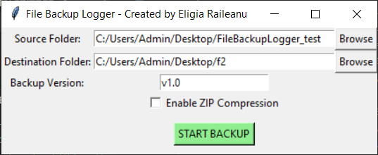
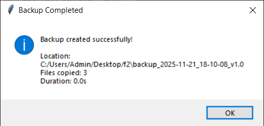
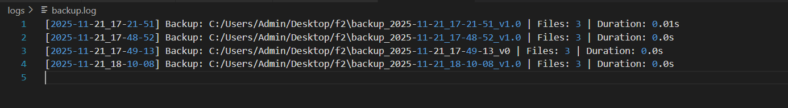

# File Backup Logger

A Python desktop application to create automated backups of folders with optional ZIP compression, timestamped names, versioning, and logging. Includes a simple graphical interface (GUI) using `tkinter`.

## Features

- Select source and destination folders
- Create backup folder with timestamp and version
- Optional ZIP compression
- Log file creation with:
  - Number of files backed up
  - Backup duration
- Saves user preferences in `config.json`
- GUI with tkinter for easy operation

## Project Structure

```
FileBackupLogger/
│
├── main.py              # GUI application
├── backup.py            # Backup logic
├── config.json          # User preferences
├── backups/             # Folder where backups are saved
├── logs/                # Log files (backup.log)
└── README.md            # This file
```

## Installation

1. Make sure Python 3.12+ is installed.

2. Clone the repository or download the files.

3. Navigate to the project folder:

```bash
cd FileBackupLogger
```


## How to Use

1. Run the GUI:

```bash
python main.py
```

2. Use **Browse** buttons to select the **Source Folder** and **Destination Folder**.

3. Enter a **Backup Version** (e.g., `v1.0`).

4. Check **Enable ZIP Compression** if you want the backup as a ZIP file.

5. Click **START BACKUP**.

6. The backup will be created in the chosen destination folder with a name like:

```
backup_2025-11-21_15-30-10_v1.0
```

or if ZIP is enabled:

```
backup_2025-11-21_15-30-10_v1.0.zip
```

## Log File

Backups are logged automatically in `logs/backup.log`. Each entry includes:

- Timestamp
- Backup folder path (or ZIP file path)
- Number of files
- Backup duration (seconds)

Example:

```
[2025-11-21_15-30-10] Backup: backups/backup_2025-11-21_15-30-10_v1.0 | Files: 120 | Duration: 5.23s
```

## Configuration

The application saves the last used source, destination, and ZIP preference in `config.json`:

```json
{
    "last_source": "C:/Users/YourName/Documents",
    "last_destination": "C:/Users/YourName/Desktop/backups",
    "zip_mode": false
}
```

This allows the GUI to remember your settings between sessions.

## Notes

- If the destination folder already exists, a `FileExistsError` will occur. Change the destination folder name or enable versioning to avoid conflicts.
- ZIP compression may take longer for large folders.
- Make sure you have write permissions for the destination folder.

## Example Screenshots

**Main GUI:**


**Backup Completed:**


**Backup log example:**



## Author

**Eligia Raileanu**  
GitHub: [https://github.com/signora-misteriosa](https://github.com/signora-misteriosa)

